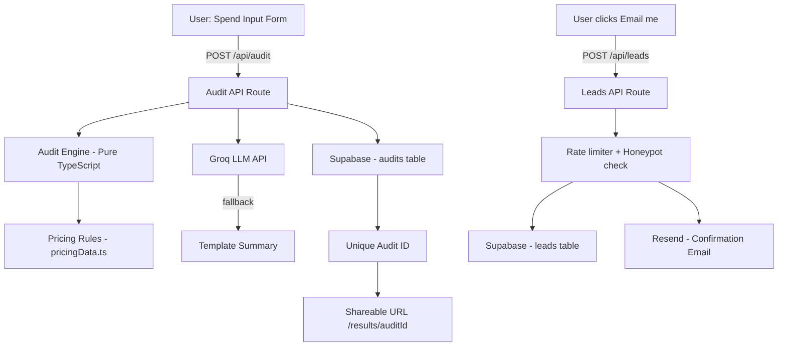

# Architecture

## System Diagram

## Data Flow

1. User fills the form with their AI tools, plans, seats, team size, use case
2. On submit, POST /api/audit receives the AuditInput JSON
3. The audit engine runs pure TypeScript rules against pricingData.ts — no AI involved here
4. Groq API is called with a structured prompt to generate a ~100 word personalized summary
5. If Groq fails (timeout, rate limit, no key), a template summary is returned instead
6. The full AuditResult is saved to Supabase audits table and an auditId is returned
7. The frontend renders the results page with savings breakdown
8. The share button copies /results/[auditId] — that page fetches from Supabase server-side
9. Email capture saves to the leads table and triggers a Resend confirmation email

## Stack Choices and Why

**Next.js 15 + TypeScript** — Chose Next.js because it handles both frontend and backend in one project (API routes built in). No need for a separate Express server. TypeScript was required by the assignment and I agree with it — the audit engine has complex nested types and TypeScript catches mistakes before runtime.

**Tailwind CSS** — Fastest way to build a good-looking UI without writing separate CSS files. Class names are co-located with the component so there's no context switching.

**Supabase** — Free hosted Postgres with a good JavaScript SDK. Set up in under 10 minutes. The audits and leads tables are simple enough that a full ORM would be overkill. Direct Supabase client calls are readable and fast.

**Groq (Llama 3)** — Used instead of Anthropic API because Groq offers a free tier with no credit card required, which matters for a 7-day assignment. The prompt engineering is the same regardless of which LLM is behind it. The fallback template means the feature works even with no API key.

**Resend** — Simplest transactional email API. Free tier, no domain required to send to verified email. One function call to send HTML email.

**Vercel** — Zero-config deployment for Next.js. Push to GitHub, it deploys automatically. Free tier is sufficient.

## What I'd Change at 10,000 Audits/Day

- Add Redis caching for pricing data (currently read from a static file on every request)
- Move the Supabase inserts to a background queue so the API response isn't blocked by DB writes
- Add proper Supabase RLS policies instead of disabling RLS (currently open for development)
- Add a CDN layer for the shareable results pages (they're server-rendered but could be statically cached per auditId)
- Split the audit engine into a separate microservice if LLM summary latency becomes a bottleneck
- Add monitoring (Sentry for errors, Vercel Analytics for performance)
