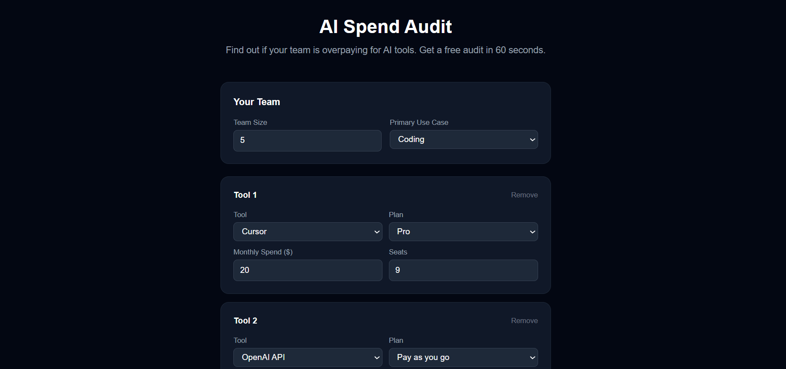
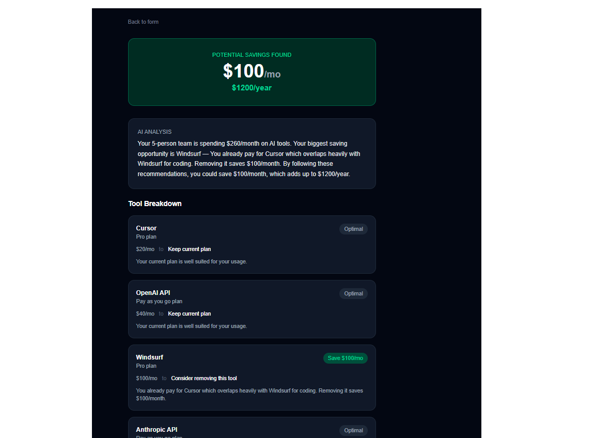
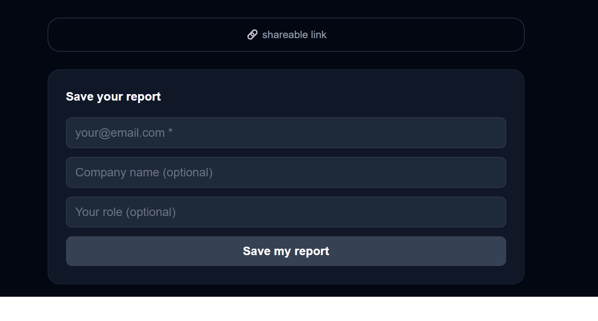

# AI Spend Audit

> Find out if your team is overpaying for AI tools. Free 60-second audit.

**Live URL:** https://ai-spend-audit-three-tau.vercel.app

---

## What I Built

A free web app for startup founders and engineering managers to audit their
AI tool subscriptions in 60 seconds. Users input which AI tools they pay for,
their current plan, monthly spend, and team size. The app calculates exactly
where they are overspending, what to switch to, and how much they could save
per month and per year.

Built for Credex as a lead-generation tool that surfaces real overspend and
nudges high-savings users toward a Credex consultation.

---

## Live Demo

https://ai-spend-audit-three-tau.vercel.app

---

## Screenshots

### Input Form



### Results Page



### Lead Capture & Shareable Link



## Features

- Input form supporting 8 AI tools with plan, seats, team size, use case
- Audit engine with 5 rule types — pure TypeScript math, no AI
- Results page with per-tool breakdown and hero savings number
- AI-generated summary via Groq Llama 3 with template fallback
- Lead capture after results — stored in Supabase, email via Resend
- Shareable unique URL per audit with Open Graph preview tags
- Form state persists across page reloads

---

## Quick Start

```bash
git clone https://github.com/Charvigosala/ai-spend-audit
cd ai-spend-audit
npm install
```

Create `.env.local`:

```
NEXT_PUBLIC_SUPABASE_URL=your_supabase_url
NEXT_PUBLIC_SUPABASE_ANON_KEY=your_supabase_anon_key
GROQ_API_KEY=your_groq_key
RESEND_API_KEY=your_resend_key
NEXT_PUBLIC_APP_URL=http://localhost:3000
```

```bash
npm run dev
```

Open http://localhost:3000

### Run Tests

```bash
npx jest
```

All 7 tests pass.

### Deploy

Connect repo to Vercel, add the 5 environment variables, click Deploy.
Next.js is auto-detected. No configuration needed.

---

## Decisions

**1. Groq instead of Anthropic API**
Anthropic free tier requires a credit card. Groq offers Llama 3 free with
no card. The prompt and fallback are identical. Swapping back is one line.

**2. Rule-based audit engine, not AI**
The engine applies fixed business rules against a live pricing table in
pricingData.ts. Savings are calculated as currentSpend minus
recommendedPlan.pricePerSeat multiplied by seats — pure math, not
hardcoded numbers. AI would produce unpredictable results a finance
person could not verify. The rules are documented in PRICING_DATA.md.

**3. Supabase over Firebase**
Supabase is Postgres — standard SQL, familiar mental model. Firebase is
NoSQL which adds complexity for two simple flat tables. Setup took 10 mins.

**4. Results before email capture**
Showing value before asking for contact details is the difference between
a tool people trust and one they abandon. Email prompt appears only after
the full audit result is visible.

**5. Fallback summary for AI failures**
If Groq API fails the app shows a template summary from audit data. The
results page always works even with no API key configured.

---

## Tech Stack

| Layer      | Choice                  |
| ---------- | ----------------------- |
| Framework  | Next.js 15 + TypeScript |
| Styling    | Tailwind CSS            |
| Database   | Supabase (Postgres)     |
| AI Summary | Groq API (Llama 3)      |
| Email      | Resend                  |
| Deployment | Vercel                  |
| Tests      | Jest + ts-jest          |

---

## Author

Gosala Venkata Charvi — 3rd Year CSE, MGIT Hyderabad
GitHub: https://github.com/Charvigosala
